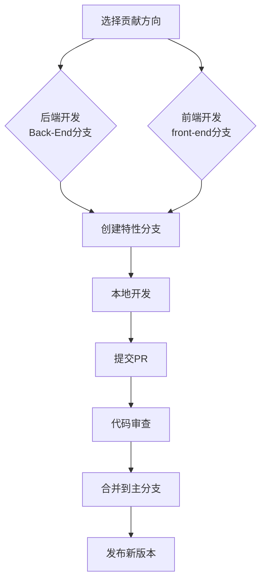

# 🤝 Lucky_SMSS 贡献指南  
> 感谢您对 Lucky_SMSS 学生信息管理系统的关注！本指南将帮助您了解如何为项目做出贡献  

## 📚 目录导航  
- [🌈 贡献流程概览](#贡献流程概览)  
- [🐞 报告问题](#报告问题)  
- [💻 代码贡献](#代码贡献)  
  - [🛠️ 开发环境搭建](#开发环境搭建)  
  - [📝 代码规范](#代码规范)  
  - [🔀 分支管理](#分支管理)  
  - [📤 提交规范](#提交规范)  
- [🔧 提交PR](#提交pr)  
- [👀 代码审查](#代码审查)  
- [🧪 测试指南](#测试指南)  
- [🚫 行为准则](#行为准则)  
- [💖 鸣谢](#鸣谢)  

---

## 🌈 贡献流程概览  


---

## 🐞 报告问题  
### 🐛 Bug 报告模板  
```markdown
## 问题描述  
[清晰描述问题现象]  

## 重现步骤  
1. 步骤一  
2. 步骤二  
3. ...  

## 影响分支  
- [ ] Back-End 分支
- [ ] front-end 分支

## 环境信息  
| 组件 | 版本 |
|------|------|
| 操作系统 | [如 Windows 11] |
| Java | [如 JDK 17] |
| Node | [如 v18.0] |
| 浏览器 | [如 Chrome 120] |

## 截图/日志  
[可选] 提供相关截图或错误日志
```

### 💡 功能请求模板  
```markdown
## 功能描述  
[详细描述希望添加的功能]  

## 使用场景  
[说明在什么情况下需要此功能]  

## 建议实现方案  
[可选] 提出您的实现思路

## 关联分支  
- [ ] Back-End 分支
- [ ] front-end 分支
```

---

## 💻 代码贡献  
### 🛠️ 开发环境搭建  

#### Back-End 分支 (Java 开发)
```bash
# 克隆后端分支
git clone -b Back-End https://gitee.com/Yangshengzhou/lucky-smss-backend.git

# 进入项目目录
cd lucky-smss-backend

# 安装依赖
mvn clean install

# 启动服务
mvn spring-boot:run
```

#### front-end 分支 (Vue 开发)
```bash
# 克隆前端分支
git clone -b front-end https://gitee.com/Yangshengzhou/lucky-smss-backend.git

# 进入项目目录
cd lucky-smss-backend

# 安装依赖
npm install

# 启动开发服务器
npm run dev
```

### 📝 代码规范  
#### 通用规范  
- 使用清晰的变量名和方法名
- 每个方法不超过50行
- 关键逻辑添加注释说明
- 避免魔法数字，使用常量代替

#### 语言特定规范  
| 分支 | 规范 | 检查工具 |  
|------|------|----------|  
| **Back-End** | Java 17 规范 | [Checkstyle](https://checkstyle.sourceforge.io/) |  
| **front-end** | Vue 3 + TypeScript | [ESLint](https://eslint.org/) + [Prettier](https://prettier.io/) |  

#### 注释规范示例  
**Java (Back-End)**  
```java
/**
 * 根据学生ID获取成绩信息
 * 
 * @param studentId 学生ID
 * @return 成绩列表
 * @throws NotFoundException 学生不存在时抛出
 */
public List<Grade> getGradesByStudentId(Long studentId) {
    // 验证学生存在性
    if (!studentRepository.existsById(studentId)) {
        throw new NotFoundException("学生不存在");
    }
    
    // 查询成绩数据
    return gradeRepository.findByStudentId(studentId);
}
```

**Vue (front-end)**  
```javascript
<script setup lang="ts">
/**
 * 学生成绩组件
 * 
 * @prop studentId - 当前学生ID
 * @emits update - 成绩更新事件
 */
const props = defineProps({
  studentId: {
    type: Number,
    required: true
  }
});

const emit = defineEmits(['update']);

// 获取学生成绩
const fetchGrades = async () => {
  try {
    const response = await api.get(`/grades/${props.studentId}`);
    return response.data;
  } catch (error) {
    console.error('获取成绩失败:', error);
    return [];
  }
};
</script>
```

### 🔀 分支管理策略  
项目采用双主干分支结构：

| 分支名称 | 用途 | 工作流程 |
|----------|------|----------|
| `Back-End` | 后端代码主分支 | Java开发专用 |
| `front-end` | 前端代码主分支 | Vue开发专用 |

**贡献流程：**  
1. 从目标主干分支创建特性分支  
   ```bash
   # 后端开发示例
   git checkout Back-End
   git checkout -b feat/user-management
   
   # 前端开发示例
   git checkout front-end
   git checkout -b fix/login-ui
   ```
2. 在特性分支上开发功能或修复问题
3. 定期从主干分支拉取更新，避免冲突
4. 开发完成后提交PR到原主干分支

**分支命名规范：**  

| 类型 | 前缀 | 示例 |  
|------|------|------|  
| 功能开发 | `feat/` | `feat/user-profile` |  
| Bug修复 | `fix/` | `fix/login-error` |  
| 文档更新 | `docs/` | `docs/api-guide` |  
| 重构优化 | `refactor/` | `refactor/auth-module` |  

### 📤 提交规范  
**提交消息格式：**  
```
[类型][模块] 简短描述

详细描述（可选）
```

**示例：**  
```
feat[user] 添加用户注册功能

- 实现手机号验证注册
- 添加短信验证码服务
- 完善错误处理逻辑
```

**提交类型说明：**  

| 类型 | 说明 | 适用分支 |  
|------|------|----------|  
| `feat` | 新功能 | Back-End/front-end |  
| `fix` | Bug修复 | Back-End/front-end |  
| `docs` | 文档更新 | Back-End/front-end |  
| `refactor` | 代码重构 | Back-End/front-end |  
| `test` | 测试相关 | Back-End/front-end |  
| `chore` | 构建/工具 | Back-End/front-end |  

---

## 🔧 提交 Pull Request  
### 步骤说明  
1. 推送特性分支到远程仓库  
   ```bash
   git push origin feat/user-management
   ```
2. 访问 [Gitee 仓库](https://gitee.com/Yangshengzhou/lucky-smss-backend)  
3. 点击 "Pull Request" 创建PR  
4. 选择正确的目标分支：  
   - 后端PR → `Back-End` 分支  
   - 前端PR → `front-end` 分支  

### PR 模板  
```markdown
## 变更描述
[详细描述本次变更的内容和目的]

## 影响范围
- [ ] Back-End
- [ ] front-end

## 关联Issue
解决 #Issue编号

## 变更类型
- [ ] 新功能
- [ ] Bug修复
- [ ] 文档更新
- [ ] 代码重构
- [ ] 测试添加

## 检查清单
- [ ] 代码通过静态检查
- [ ] 添加/更新了单元测试
- [ ] 更新了相关文档
- [ ] 自测功能正常
- [ ] 遵循了代码规范

## 效果展示

```

---

## 👀 代码审查流程  
### 审查阶段  
1. **自动化检查**（立即触发）  
   - 后端：Maven构建 + 单元测试  
   - 前端：ESLint检查 + 单元测试  
   
2. **人工审查**（24-48小时内）  
   - 维护者检查代码质量  
   - 验证功能实现  
   - 检查文档更新  

3. **修改请求**（如需改进）  
   - 创建评论指出问题  
   - 提供改进建议  

4. **批准合并**  
   - 通过所有检查后合并  
   - 关闭关联Issue  

### 审查标准  
| 维度 | Back-End 要求 | front-end 要求 |  
|------|---------------|----------------|  
| **代码质量** | 无Sonar严重问题 | 通过ESLint检查 |  
| **功能实现** | 满足需求文档 | UI/UX符合设计 |  
| **测试覆盖** | 关键服务≥80% | 核心组件≥75% |  
| **文档更新** | JavaDoc完整 | 组件注释齐全 |  
| **性能影响** | 无显著性能下降 | 无内存泄漏 |  

---

## 🧪 测试指南  
### Back-End 测试  
```bash
# 运行所有测试
mvn test

# 运行特定测试类
mvn test -Dtest=UserServiceTest

# 生成测试报告
mvn surefire-report:report
```

### front-end 测试  
```bash
# 运行单元测试
npm run test:unit

# 运行组件测试
npm run test:components

# 生成覆盖率报告
npm run test:coverage
```

### 覆盖率要求  
| 分支 | 关键模块 | 最低覆盖率 |  
|------|----------|------------|  
| Back-End | Service层 | 85% |  
| Back-End | Controller层 | 70% |  
| front-end | 核心组件 | 80% |  
| front-end | 工具函数 | 95% |  

---

## 🚫 行为准则  
所有参与者需遵守以下准则：  
1. **尊重他人**：使用专业、友善的语言交流  
2. **包容开放**：欢迎不同背景和经验的贡献者  
3. **建设性反馈**：提出具体改进建议而非单纯批评  
4. **诚实守信**：如实报告问题，不夸大功能  
5. **安全第一**：不引入恶意代码或后门  

**违规处理：**  
- 初次违规：私下提醒  
- 二次违规：公开警告  
- 严重违规：永久禁止参与  

> 问题报告：yangsz03@foxmail.com  

---

以下是优化后的贡献者墙，提升视觉一致性、增加交互指引，并保留手动维护的灵活性：


## 👥 贡献者墙  

我们衷心感谢以下开发者对 Lucky_SMSS 的贡献！✨  

### 🏆 活跃贡献者（按贡献频率排序）  
<div style="display: flex; gap: 12px; padding: 16px; background: #f8f9fa; border-radius: 8px;">
<!-- 主头像链接（优先使用 Gitee 官方头像 API） -->
<a href="https://gitee.com/Yangshengzhou" target="_blank" title="项目创始人 & 全栈开发">

</a>
<a href="https://gitee.com/contributor1" target="_blank" title="后端模块优化">

<!-- 隐藏的错误提示（仅开发者可见） -->
<noscript>⚠️ 头像加载失败时，请检查 Gitee 用户名是否正确</noscript>
</a>
<a href="https://gitee.com/contributor2" target="_blank" title="前端交互设计">

</a>
</div>

### 🚀 如何加入我们？  
1. **提交代码**：修复 Bug、新增功能或优化性能  
2. **完善文档**：更新接口说明、撰写用户指南  
3. **反馈问题**：通过 [Issue 模板](链接) 提交有效建议  
4. **参与测试**：协助验证新功能或提供测试报告  

> 所有符合规范的贡献将在审核后加入贡献者墙，优秀贡献者可获得项目专属徽章！  

### 📍 贡献记录查询  
- [GitHub 贡献者列表](https://github.com/Yangshengzhou03/Lucky_SMSS/contributors)（自动更新）  
- [Gitee 贡献者列表](https://gitee.com/Yangshengzhou/lucky-smss/contributors)（手动同步）  