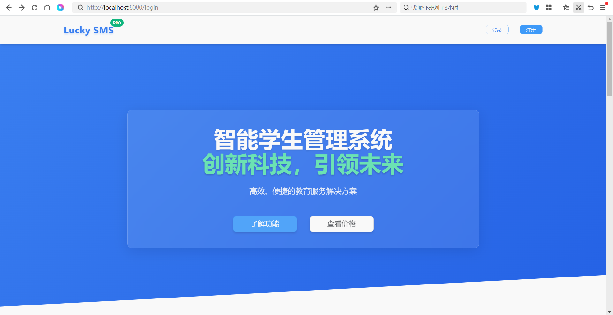
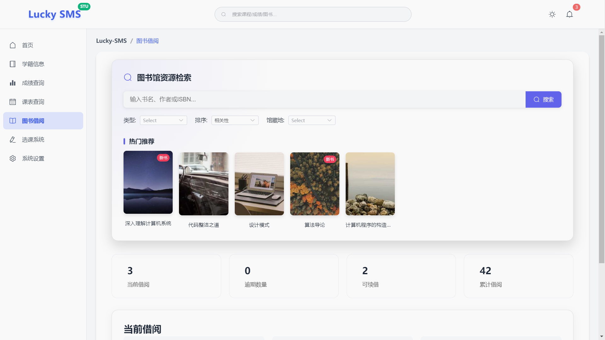
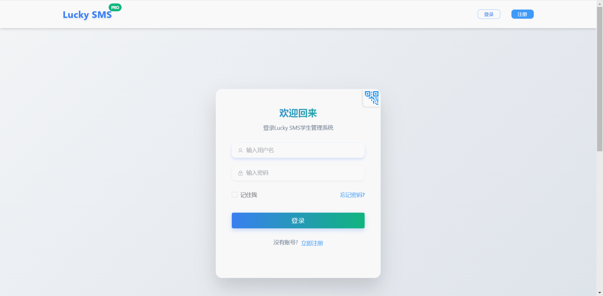
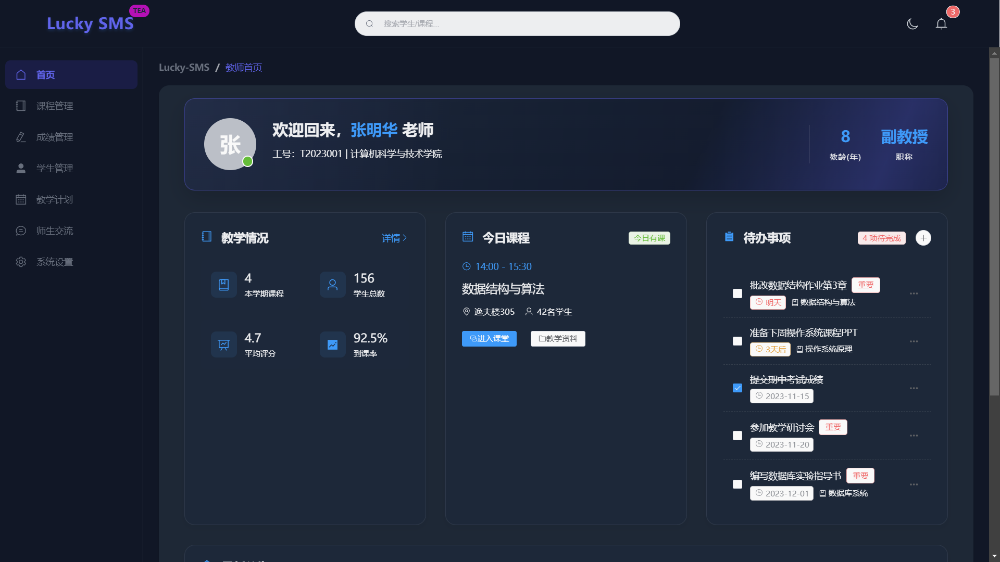

<div align="center">
<h1>Lucky_SMSS - 学生信息管理系统</h1>
</div>

<div align="center">
  <a href="https://github.com/YangShengzhou03/Lucky_SMSS">
    
  </a>

  <a href="https://opensource.org/licenses/MIT">
    
  </a>

  <a href="https://spring.io/projects/spring-boot">
    
  </a>
</div>

## 目录
1. [✨ 项目概述](#-项目概述)
2. [🚀 技术架构](#-技术架构)
3. [🌟 核心功能](#-核心功能)
4. [📸 系统截图](#-系统截图)
5. [💻 安装部署](#-安装部署)
6. [📖 使用说明](#-使用说明)
7. [📁 目录结构](#-目录结构)
8. [🤝 参与贡献](#-参与贡献)
9. [❓ 常见问题](#-常见问题)
10. [📞 联系我们](#-联系我们)
11. [📜 开源许可](#-开源许可)

## ✨ 项目概述
Lucky_SMSS 是一款基于 **Vue 3** 和 **Spring Boot 3** 构建的**开源学生信息管理系统**，专为教育机构打造。系统采用**前后端分离架构**，支持**多角色权限管理**（管理员、教师、学生），提供一站式教育管理解决方案。

**💡 适用场景**
- 毕业设计与课程作业
- 中小学及高校信息化系统
- 培训机构管理平台
- 商业项目开发基础框架

## 🚀 技术架构

### 🔧 前端技术栈
| 技术                | 描述                                                         |
|---------------------|--------------------------------------------------------------|
| **Vue 3**           | 渐进式 JavaScript 框架，用于构建用户界面                     |
| **Vue Router**      | Vue.js 官方路由管理器，实现页面跳转与路由控制                 |
| **Pinia**           | Vue.js 的官方状态管理库，用于集中管理应用组件的共享状态       |
| **Element Plus**    | 基于 Vue 3 的组件库，提供丰富的 UI 组件，加速界面开发         |
| **Vite**            | 下一代前端构建工具，显著提升开发体验与构建效率                 |
| **Axios**           | 基于 Promise 的 HTTP 客户端，用于浏览器和 Node.js 中的数据交互 |

### 🛠️ 后端技术栈
| 技术                | 描述                                                         |
|---------------------|--------------------------------------------------------------|
| **Spring Boot 3**   | 简化 Spring 应用开发的框架，提供自动配置和快速开发的能力     |
| **Spring Security** | 提供强大的身份验证和授权功能，保障系统安全访问                |
| **JWT**             | JSON Web Token，用于在网络应用间安全传递声明，支持无状态认证  |
| **MyBatis-Plus**    | 简化 MyBatis 开发的增强工具，提供 CRUD 操作和代码生成功能      |
| **MySQL 8+**        | 高性能关系型数据库，存储系统核心业务数据                      |
| **Redis**           | 内存数据存储，用于缓存高频访问数据，提升系统响应速度          |
| **Swagger**         | API 文档生成工具，方便接口开发、测试与协作                    |

## 🌟 核心功能

### 👨💼 **管理员功能**
- 用户管理：全量管理系统用户（创建、编辑、删除、状态控制）
- 角色权限配置：自定义角色并分配精细化权限，支持权限粒度控制
- 系统设置：配置学校基础信息、学期管理、数据字典维护等
- 数据统计分析：多维度展示系统使用情况、学生数据统计与可视化报表

### 👩🏫 **教师功能**
- 课程管理：创建、编辑、下架课程信息，维护课程大纲与教学计划
- 成绩录入：支持批量导入和单个录入学生成绩，支持成绩修改与审核
- 考勤管理：记录学生出勤情况（正常、迟到、早退、缺勤），生成考勤报表
- 教学资源管理：上传、分类、分享教学资料（课件、视频、习题等）

### 👨🎓 **学生功能**
- 个人信息管理：查看和修改个人基本信息，支持头像上传与资料完善
- 课程查询：浏览课程列表、查看课程详情，支持按条件筛选感兴趣的课程
- 成绩查询：查看个人各科成绩、平均分及排名，支持成绩趋势分析
- 考勤查询：查看个人出勤记录与统计，及时了解出勤情况

## 📸 系统截图

### 首页页面

*图1：系统首页界面*

### 系统功能

*图2：管理员后台界面，展示系统数据概览与功能入口*

### 登录界面

*图3：登录界面*

### 教师首页

*图4：教师首页*

## 💻 安装部署

### 🔧 环境准备
- JDK 17及以上版本（确保后端运行环境兼容）
- Node.js 16及以上版本（支持前端依赖安装与运行）
- MySQL 8.0及以上版本（推荐使用最新稳定版）
- Redis（用于缓存，提升系统性能）

### 🚀 后端部署
1. 克隆项目到本地环境
2. 创建数据库：使用MySQL客户端执行建库语句，指定字符集为utf8mb4（支持多语言与特殊符号）
3. 修改配置：编辑后端配置文件，填写数据库连接信息（地址、端口、用户名、密码）、Redis配置及系统基础参数
4. 启动应用：通过Maven命令启动应用，或打包为Jar文件部署到服务器

### 🖥️ 前端部署
1. 进入前端项目目录
2. 安装依赖：通过包管理工具安装项目所需依赖
3. 开发环境：启动开发服务器，支持热重载，方便实时开发调试
4. 生产环境：构建优化后的静态文件，部署到Nginx等Web服务器

## 📖 使用说明

### 🔑 系统访问
- 访问地址：部署完成后，通过服务器IP或域名访问（默认端口可在配置中修改）
- 默认管理员账号：用户名admin，初始密码123456（首次登录建议立即修改）

### 📝 主要功能指引
1. **管理员操作流程**：
    - 登录系统后，优先完善学校基础信息与学期设置
    - 创建教师与学生账号，或配置批量导入模板
    - 根据需求自定义角色与权限分配
    - 通过数据统计模块监控系统运行状态

2. **教师操作流程**：
    - 登录后创建课程并维护课程信息
    - 关联授课班级与学生
    - 定期录入学生成绩与考勤数据
    - 上传教学资源供学生查阅

3. **学生操作流程**：
    - 登录后完善个人信息
    - 浏览并查看已选课程详情
    - 查看个人成绩与出勤记录
    - 下载教师分享的教学资源

## 📁 目录结构
```
Lucky_SMSS/
├── backend/                   # 后端代码模块
│   ├── src/
│   │   ├── main/
│   │   │   ├── java/          # Java源代码目录
│   │   │   │   └── com/
│   │   │   │       └── lucky/
│   │   │   │           └── smss/
│   │   │   │               ├── controller/  # 控制器层（处理请求）
│   │   │   │               ├── service/     # 服务层（业务逻辑处理）
│   │   │   │               ├── mapper/      # 数据访问层（数据库交互）
│   │   │   │               ├── entity/      # 实体类（映射数据库表）
│   │   │   │               └── config/      # 配置类（系统参数配置）
│   │   │   └── resources/     # 资源文件目录
│   │   │       ├── static/    # 静态资源（如文件模板）
│   │   │       ├── templates/ # 模板文件（如邮件模板）
│   │   │       └── application.yml # 核心配置文件
│   │   └── test/              # 测试代码目录（单元测试与集成测试）
│   └── pom.xml                # Maven配置文件（依赖管理）
└── frontend/                  # 前端代码模块
    ├── public/                # 公共资源（图标、入口HTML等）
    ├── src/                   # 源代码目录
    │   ├── assets/            # 静态资源（图片、样式等）
    │   ├── components/        # 通用组件（可复用UI元素）
    │   ├── router/            # 路由配置（页面跳转规则）
    │   ├── store/             # 状态管理（共享数据存储）
    │   ├── views/             # 视图页面（各功能模块页面）
    │   └── App.vue            # 主应用组件（页面入口）
    ├── package.json           # 依赖配置文件（前端包管理）
    └── vite.config.js         # Vite构建配置文件
```

## 🤝 参与贡献
我们欢迎所有开发者参与项目改进与功能扩展，共同提升系统质量。贡献流程如下：

1. **Fork 仓库**：将项目复制到个人GitHub空间
2. **创建特性分支**：基于main分支创建新分支，命名规范建议使用"feat/功能名称"或"fix/问题描述"
3. **提交规范化代码**：遵循项目代码风格，提交信息使用规范格式（如"feat: 添加课程评价功能"）
4. **推送分支**：将本地分支推送到个人远程仓库
5. **创建 Pull Request**：提交合并请求到原仓库，描述修改内容与目的，等待审核

## ❓ 常见问题

### 💥 启动后端时出现数据库连接错误
- **可能原因**：数据库配置参数错误、数据库服务未启动、网络端口被占用、数据库用户权限不足
- **解决方案**：
    1. 检查配置文件中的数据库地址、端口、用户名、密码是否正确
    2. 确认MySQL服务已正常启动，可通过命令行或服务管理工具查看
    3. 检查防火墙设置，确保数据库端口（默认3306）允许连接
    4. 验证数据库用户是否拥有指定数据库的读写权限

### ⏳ 前端依赖安装缓慢或失败
- **可能原因**：npm官方镜像源访问速度慢、网络连接不稳定、Node.js版本不兼容
- **解决方案**：
    1. 切换国内镜像源：使用淘宝镜像（`npm install --registry=https://registry.npm.taobao.org`）或腾讯云镜像
    2. 安装nrm工具管理镜像源：`npm install -g nrm`，通过`nrm use taobao`快速切换
    3. 检查Node.js版本，推荐使用LTS稳定版，避免版本过高或过低
    4. 网络不稳定时，可尝试多次安装或使用代理

### 🚫 跨域请求问题
- **可能原因**：前后端分离架构下，浏览器的同源策略限制不同域名/端口间的请求
- **解决方案**：
    1. 后端已默认配置CORS跨域支持，确保配置包含前端访问域名
    2. 开发环境可通过Vite代理配置，将API请求代理到后端服务地址
    3. 生产环境建议通过Nginx配置反向代理，统一域名与端口访问

## 📞 联系我们
- 邮箱：3555844679@qq.com
- GitHub：https://github.com/YangShengzhou03/Lucky_SMSS

欢迎反馈使用过程中遇到的问题或功能建议，我们将持续优化系统体验。

## 📜 开源许可
本项目采用 [MIT License](https://opensource.org/licenses/MIT) 授权，允许自由使用、修改和分发。使用时请遵守许可证条款，保留原作者信息与版权声明。