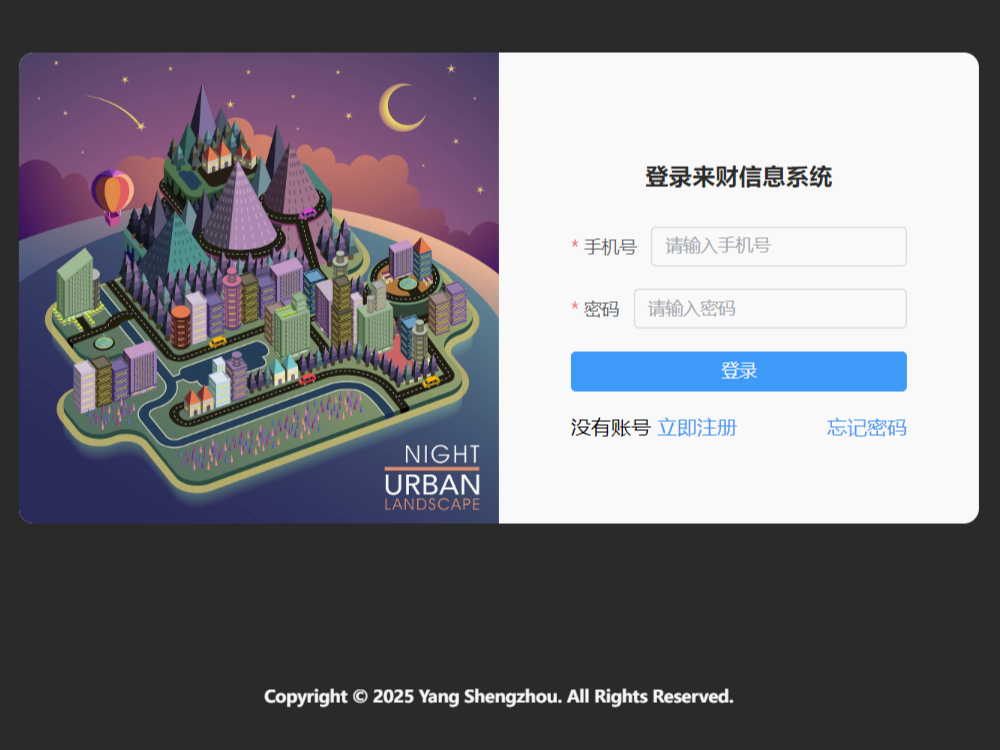
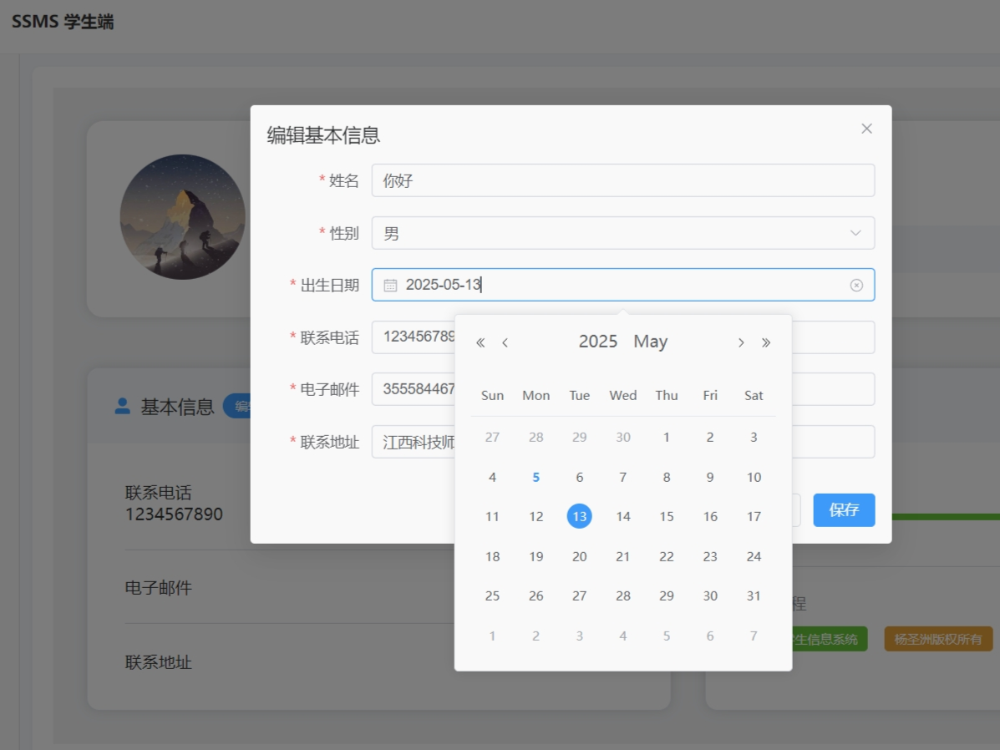
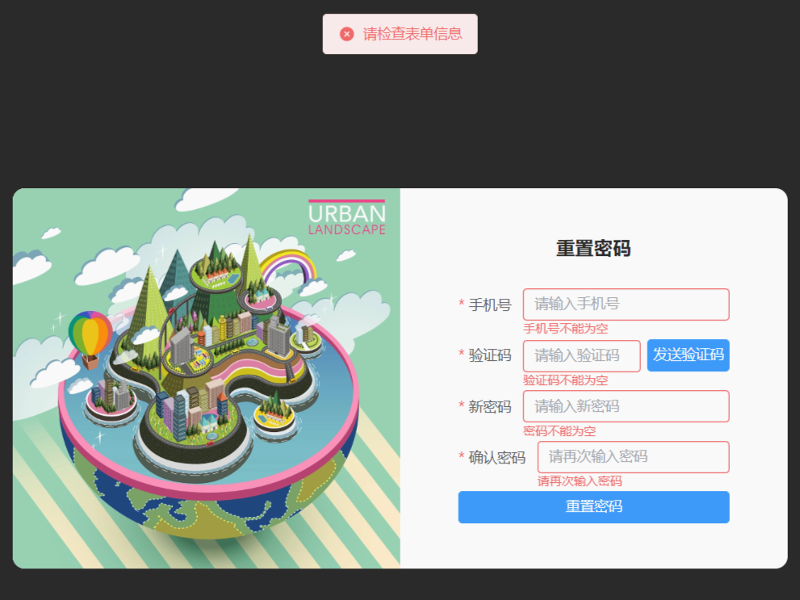
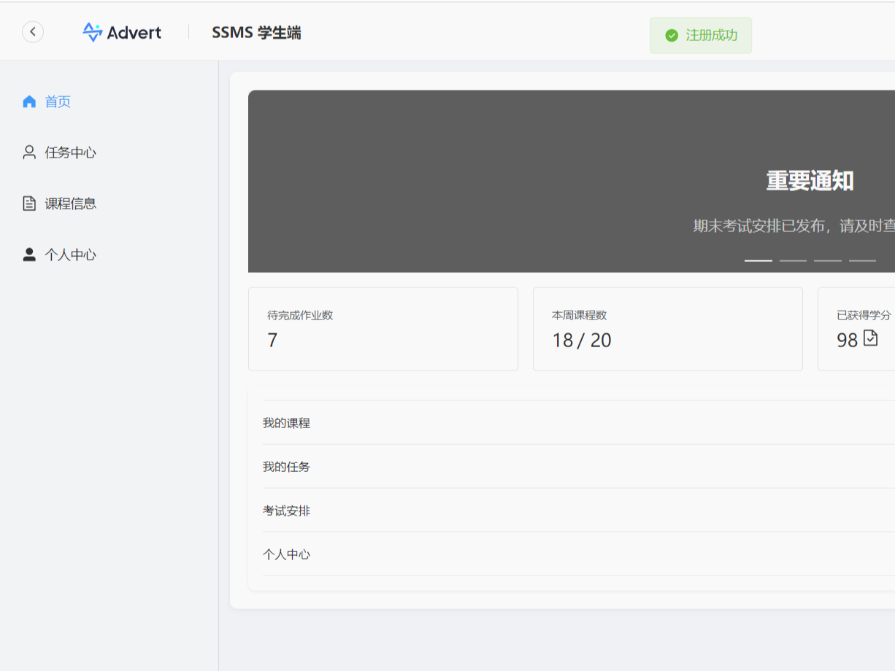
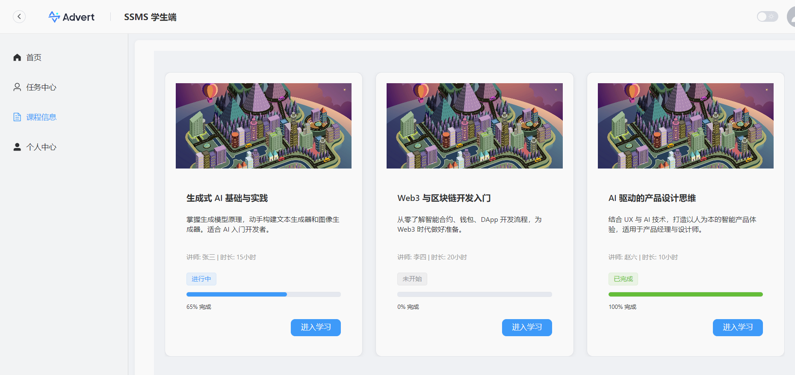
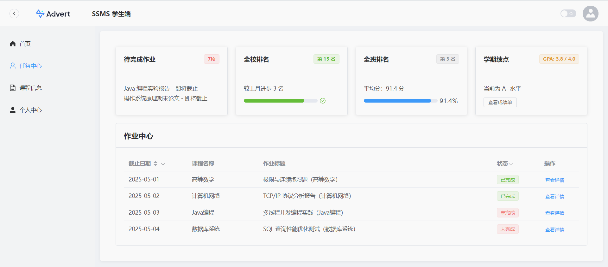
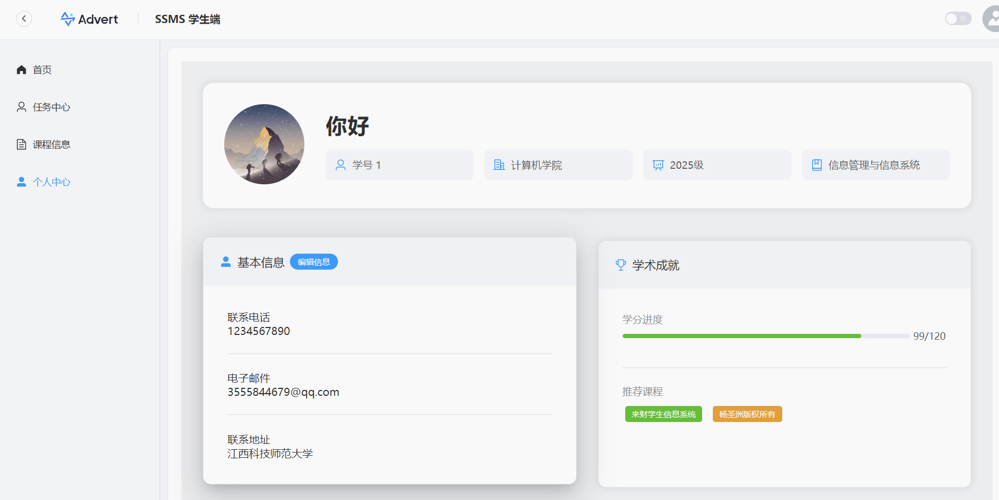

# 🎓 Lucky_SMSS（来财学生信息管理系统）

**免费可商用、适合毕业设计与课程设计等用途**
---


---


---

[视频介绍](https://www.bilibili.com/video/BV1byVsziErM/)
一个基于 Vue 3 和 Spring Boot 构建的学生信息管理系统，支持学生、教师及管理员三种角色操作。

---


---

## 目录

- [项目简介](#项目简介)
- [功能特性](#功能特性)
- [技术栈](#技术栈)
- [系统架构](#系统架构)
- [工作原理](#工作原理)
- [环境准备](#环境准备)
- [获取代码](#获取代码)
- [数据库初始化](#数据库初始化)
  - [手动调整数据库配置](#手动调整数据库配置)
  - [数据库表结构](#数据库表结构)
- [后端服务启动](#后端服务启动)
  - [Spring Boot 文件结构](#spring-boot-文件结构)
  - [手动调整后端端口](#手动调整后端端口)
  - [JWT 的使用](#jwt-的使用)
  - [CORS 问题解决](#cors-问题解决)
- [前端应用构建与部署](#前端应用构建与部署)
  - [手动调整前端端口](#手动调整前端端口)
  - [前后端通信](#前后端通信)
- [常见问题](#常见问题)
- [参与贡献](#参与贡献)
- [联系作者](#联系作者)

---

---

## 项目简介

Lucky_SMSS 是在2025年五一假期期间开发的一个开源项目，旨在为教学场景提供一个简单易用的学生信息管理系统。系统包括登录注册、权限控制、个人信息管理、课程管理等功能模块。

本项目完全免费且可用于商业用途、投标项目、毕业设计、课程设计等一切用途。无论是新手还是有经验的开发者，都可以轻松上手并根据需要进行二次开发。

---

---

## 功能特性

- **多角色支持**：学生、教师、管理员不同权限。
- **基础信息管理**：个人资料修改、头像上传等。
- **课程管理**：查看课程详情、选课（未来计划）。
- **任务管理**：发布任务、完成情况跟踪。
- **成绩录入**：教师录入学生成绩，学生查看成绩。

## 技术栈

### 前端
- **Vue 3**: 最新一代的 Vue.js 框架，支持 Composition API 和更好的性能（就像一辆全新的跑车，比旧款更快更稳定）。
- **TypeScript**: 强类型语言，帮助减少错误，提高代码质量（想象一下给每个零件都贴上标签，这样组装时就不会出错）。
- **Element Plus**: 基于 Vue 3 的 UI 组件库，提供了丰富的组件供快速开发使用（类似于乐高积木，可以快速搭建出漂亮的界面）。
- **Axios**: HTTP 客户端，用于发送请求并与后端交互（就像快递员，负责从前端向后端传递信息）。
- **Vue Router**: Vue.js 的官方路由管理器，用于实现单页应用（SPA）中的页面导航（就像是地图，告诉用户从哪里到哪里去）。

### 后端
- **Spring Boot**: 简化了新 Spring 应用的初始搭建以及开发过程，提供了多种开箱即用的功能（类似厨房里的多功能料理机，让烹饪变得简单）。
- **JWT (JSON Web Token)**: 用于用户身份验证和授权，确保安全性（可以想象成电影票，只有持有有效电影票的人才能进入电影院）。
- **MyBatis**: 一种持久层框架，简化了数据库访问代码的编写（就像一本字典，让你能够轻松查找单词的意思）。
- **Swagger UI**: 提供了一套完整的接口文档工具，方便前后端联调（相当于说明书，告诉你每个按钮的作用是什么）。

### 数据库
- **MySQL**: 关系型数据库管理系统，适用于各种规模的应用程序（就像图书馆的书架，有序地存放着所有的书籍）。

## 系统架构

系统采用前后端分离的设计模式，前端使用 Vue 3 + Element Plus 实现用户界面，后端基于 Spring Boot 提供 RESTful API。JWT 用于用户身份验证和授权。

```
+------------------+        +-------------------+
|    Frontend      | <----> |     Backend       |
| (Vue 3, Element+)|        |(Spring Boot, JWT) |
+------------------+        +-------------------+
          |                          |
          v                          v
   +-------------+            +--------------+
   | Web Browser |            |    MySQL     |
   +-------------+            +--------------+
```

## 工作原理

1. **用户登录或注册**：用户通过前端页面输入用户名和密码进行登录或注册操作（就像你走进一家商店，出示会员卡或者申请新的会员卡）。
2. **生成 JWT 并返回**：登录成功后，后端生成 JWT 并返回给前端，前端将该 Token 存储在本地存储中（Token 就像一张电子门票，包含了用户的ID和角色信息，有效期等数据）。
3. **携带 Token 请求**：在后续请求中，前端会在请求头中携带该 Token，后端通过解析 Token 来确认用户身份并执行相应操作（每次访问都需要出示这张门票，以证明你是合法的观众）。
4. **权限控制**：不同的角色（学生、教师、管理员）拥有不同的权限，后端根据用户角色返回不同的数据和操作选项（就像电影院的不同座位区，VIP 区只能 VIP 才能进入）。

---



---

## 环境准备

为了顺利运行该项目，请确保您的计算机已安装以下软件：

- **Node.js (v16+)**: 前端开发环境，建议使用 Node Version Manager (nvm) 进行版本管理（就像你家里的冰箱，用来保存食物，Node.js 用来保存你的 JavaScript 代码）。
- **Java 17+**: 后端开发环境，推荐使用 JDK 17（想象成一台超级电脑，专门用来处理复杂的计算任务）。
- **Maven (3.8.x+)**: Java 项目的构建工具，用于管理依赖关系（就像一个大型仓库，帮你整理和存放所有你需要的工具和材料）。
- **MySQL (8.0+)**: 数据库管理系统，用于存储和管理应用程序的数据（就像一个巨大的档案柜，存放所有的文件和记录）。

如果您在中国，建议将 Maven 的中央仓库替换为阿里云镜像，以加快依赖下载速度。可以在 `~/.m2/settings.xml` 中添加如下配置：

```xml
<mirrors>
    <mirror>
        <id>aliyun-central</id>
        <mirrorOf>central</mirrorOf>
        <name>Aliyun Central</name>
        <url>https://maven.aliyun.com/repository/central</url>
    </mirror>
</mirrors>
```

对于 npm 包的下载，您可以使用淘宝镜像源加速下载：

    npm config set registry https://registry.npmmirror.com

## 获取代码

首先克隆仓库到本地：

    git clone https://gitee.com/yangshengzhou/lucky-ssms.git
    cd lucky-ssms

请注意，您需要分别下载前端和后端代码，并按照各自的说明进行部署。

## 数据库初始化

进入 back-end 分支执行 SQL 脚本初始化数据库：

    mysql -u root -p < 创建数据库.sql

### 手动调整数据库配置

编辑 `back-end/src/main/resources/application.properties` 文件，修改以下配置项以匹配您的数据库设置：

    spring.datasource.url=jdbc:mysql://localhost:3306/your_database_name?useSSL=false&serverTimezone=UTC
    spring.datasource.username=your_db_username
    spring.datasource.password=your_db_password

请将 `your_database_name` 替换为您创建的数据库名称，`your_db_username` 和 `your_db_password` 替换为您的数据库用户名和密码。

### 数据库表结构

#### 用户表 (users)
- uid: 用户ID（主键）
- password: 密码哈希值
- role: 用户角色（admin/student/teacher）
- phone: 手机号码（唯一）
- email: 电子邮箱（唯一）
- avatarUrl: 用户头像URL
- createdAt: 创建时间
- updatedAt: 最后修改时间
- lastLogin: 最近登录时间
- status: 账号状态（启用/禁用）

#### 学生表 (students)
- uid: 学生唯一标识符（外键）
- name: 学生姓名
- gender: 性别（Male/Female）
- birthDate: 出生日期
- enrollmentDate: 入学日期
- class: 所在班级名称
- major: 所学专业名称
- college: 所属学院名称
- address: 家庭住址
- studentStatus: 学籍状态（在读/休学/毕业/退学）
- creditsCompleted: 已修学分
- creditsRequired: 要求总学分

#### 教师表 (teachers)
- uid: 用户ID（主键），外键关联到 users 表
- name: 姓名
- gender: 性别（Male/Female）
- title: 职称（教授/副教授等）
- hireDate: 入岗时间
- department: 所属系别
- researchInterests: 研究兴趣或领域
- educationBackground: 学历背景（博士/硕士等）
- graduatedFrom: 毕业院校

## 后端服务启动

切换到 back-end 目录，并运行以下命令来启动 Spring Boot 应用：

    mvn clean package
    java -jar target/your-application-name.jar

或者直接使用 Maven 插件运行应用：

    mvn spring-boot:run

默认情况下，Spring Boot 应用将在 http://localhost:8090 上运行。如果需要更改端口号，请编辑 `application.properties` 文件中的 `server.port` 属性，如下所示：

    server.port=自定义端口号

### Spring Boot 文件结构

```
lucky-smss/
├── back-end           # 后端部分
│   ├── src/             # Java 源码 + 配置文件
│   │   └── main/         # 主目录
│   │       ├── java/      # Java 源代码
│   │       └── resources/ # 配置文件
│   ├── pom.xml          # Maven 构建文件
│   └── 创建数据库.sql   # 初始化数据库脚本
└── README.md           # 当前文档
```

### 手动调整后端端口

如果您想更改后端服务的端口号，请在 `back-end/src/main/resources/application.properties` 文件中找到并修改 `server.port` 参数：

    server.port=自定义端口号

### JWT 的使用

在我们的项目中，JWT 用于用户身份验证和授权。每当用户登录成功后，后端会生成一个包含用户ID和角色信息的 Token，并将其返回给前端。这个 Token 类似于一张电子门票，包含以下数据：
- 用户ID
- 角色信息（如学生、教师、管理员）
- 过期时间

Token 的过期时间和密钥可以在 `application.properties` 文件中找到并修改：

    jwt.secret=your_secret_key_here
    jwt.expiration=3600

这里的 `jwt.secret` 是用来加密 Token 的密钥，而 `jwt.expiration` 则是 Token 的过期时间（秒）。你可以根据需要调整这些值。

### CORS 问题解决

CORS（跨域资源共享）问题是当你的前端和后端不在同一个域名下时遇到的问题（想象一下，你不能随意进出别人的家）。解决方法是在后端配置中允许特定域名访问（相当于主人邀请你进入他们的家）。在 Spring Boot 中，可以通过添加注解 `@CrossOrigin` 或者在配置类中进行全局配置。

例如，在控制器类上添加 `@CrossOrigin(origins = "http://localhost:8080")`，这将允许来自 `http://localhost:8080` 的请求访问你的 API。

### 修改 Token 过期时间和密钥

在 `application.properties` 文件中，你可以找到并修改 JWT 的过期时间和密钥：

    jwt.secret=your_secret_key_here
    jwt.expiration=3600

这里的 `jwt.secret` 是用来加密 Token 的密钥，而 `jwt.expiration` 则是 Token 的过期时间（秒）。

## 前端应用构建与部署

### 安装依赖并构建

切换到 front-end 目录，安装所有必要的 npm 包：

    npm install

然后，构建生产版本的 Vue 应用：

    npm run build

这将在 `dist` 目录下生成静态文件。

### 部署前端应用

您可以选择多种方式部署前端应用，这里提供两种常见的方法：

- **使用 Nginx**：将 `dist` 目录下的所有文件复制到 Nginx 的 HTML 目录中，并根据需要调整 Nginx 配置文件。示例 Nginx 配置如下：

      server {
          listen       80;
          server_name  localhost;

          location / {
              root   /path/to/dist/;
              index  index.html index.htm;
              try_files $uri $uri/ /index.html;
          }
      }

- **使用 Docker**：如果您更倾向于容器化部署，可以创建一个 Dockerfile 并基于 Nginx 或其他 Web 服务器来部署前端应用。

### 手动调整前端端口

如果您想更改前端开发服务器的端口号，可以编辑 `front-end/vue.config.js` 文件，添加或修改以下配置：

    devServer: {
        port: 自定义端口号
    }

### 前后端通信

由于前后端分离，前端和后端通常会运行在不同的端口上。在开发环境中，您需要确保前端能够正确地向后端发起请求。可以在前端项目的 `src/api/index.js` 文件中修改 API 请求的基础 URL：

    export const BASE_URL = 'http://localhost:8090'; // 修改为后端实际运行的地址

## 常见问题

### 第一次部署时缺少依赖

如果您是第一次部署该项目，可能会遇到缺少依赖的情况。确保您已经正确安装了所有依赖包：

- 对于前端，请确保在 `front-end` 目录下运行 `npm install`。如果网络较慢，可以尝试更换 npm 镜像源：
  
      npm config set registry https://registry.npmmirror.com

- 对于后端，请确保在 `back-end` 目录下运行 `mvn clean install`。如果在中国，记得替换 Maven 中央仓库为阿里云镜像以加快依赖下载速度：

      <mirrors>
          <mirror>
              <id>aliyun-central</id>
              <mirrorOf>central</mirrorOf>
              <name>Aliyun Central</name>
              <url>https://maven.aliyun.com/repository/central</url>
          </mirror>
      </mirrors>

### 如何解决前后端端口不一致的问题？

由于前后端分离，前端和后端通常会运行在不同的端口上。在开发环境中，您需要确保前端能够正确地向后端发起请求。可以在前端项目的 `src/api/index.js` 文件中修改 API 请求的基础 URL：

    export const BASE_URL = 'http://localhost:8090'; // 修改为后端实际运行的地址

### 忘记密码的逻辑未实现

由于时间原因，忘记密码的后端逻辑尚未实现。未来可以通过邮箱发送验证码的方式实现真实的验证登录（想象一下，当你忘记了家门钥匙，房东给你发了一条短信，告诉你临时密码）。

### 数据库密码在哪改？

数据库密码可以在 `back-end/src/main/resources/application.properties` 文件中找到并修改：

    spring.datasource.password=your_db_password

### 目前后端哪些功能不完善等待你们完善

目前后端的一些功能如忘记密码、邮件验证码发送等功能尚未实现，期待大家的贡献和完善！

## 参与贡献

欢迎任何形式的贡献！请阅读 CONTRIBUTING.md 获取更多信息。

## 联系作者

如果有任何问题或建议，请通过以下方式联系我：

- GitHub/Gitee: [@yangshengzhou](https://gitee.com/yangshengzhou)
- Email: yangsz03@foxmail.com

> 程序员的理想是改变世界，但现实是先得养活自己。“来财”这个名字，既是对项目的期许，也是对每一位使用者的祝福：学有所成，用有所得，早“来财”，早自由！🎓

---

我提供了详细的解释和生动的例子，希望能帮助小白用户更好地理解和使用项目，并提供足够的指导帮助他们顺利完成部署和开发。
我们相信开源的价值不仅在于分享，更在于共建与成长。无论你是学习中遇到困难，还是希望为项目添砖加瓦，都欢迎随时加入我们。让我们一起把“来财”打造成一个真正有用、有温度、还能带来机会的好项目！😊